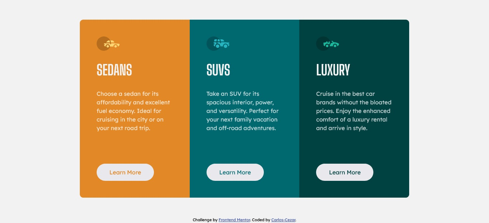

# Frontend Mentor - 3-column preview card component solution

This is a solution to the [3-column preview card component challenge on Frontend Mentor](https://www.frontendmentor.io/challenges/3column-preview-card-component-pH92eAR2-). Frontend Mentor challenges help you improve your coding skills by building realistic projects.

## Table of contents

- [Overview](#overview)
  - [The challenge](#the-challenge)
  - [Screenshot](#screenshot)
  - [Links](#links)
- [My process](#my-process)
  - [Built with](#built-with)
  - [Useful resources](#useful-resources)
- [Author](#author)

## Overview

### The challenge

Users should be able to:

- View the optimal layout depending on their device's screen size
- See hover states for interactive elements

### Screenshot

### Links

- [Solution URL](https://github.com/Carlos-Cezar/3-column-preview-card-component-main)
- [Live Site URL](https://carlos-cezar.github.io/fem-3-column-preview-card-component-main/)

## My process

### Built with

- Semantic HTML5 markup
- CSS custom properties
- Flexbox
- CSS Grid
- Mobile-first workflow

### Useful resources

- [MDN Web Docs](https://developer.mozilla.org/en-US/) - This helped me get answers for the questions i had.

## Author

- Website - [Carlos-Cezar](https://github.com/Carlos-Cezar)
- Frontend Mentor - [@Carlos-Cezar](https://www.frontendmentor.io/profile/Carlos-Cezar)
- Instagram - [@motta.2k](https://www.instagram.com/motta.2k/)
